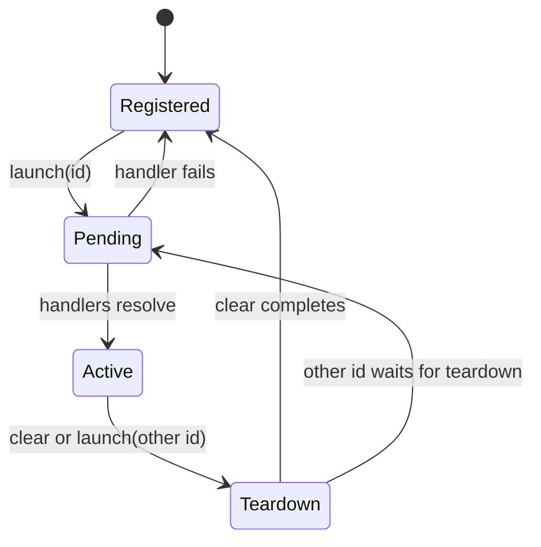

# Lifecycle and Ownership

> Commands describe discoverable development states, while the application owns setup, teardown, and the meaning of every transition.

State Launcher has one process-local registry. A command handle is a stable
definition; registration makes it visible; handlers provide the behavior. The
browser launcher and headless API observe and use the same records.

## Command identity

Use a stable dotted id such as `billing.paymentFailed` or
`inbox.manyMessages`:

- The full id is the command identity.
- The first dotted segment is only a browser-panel grouping hint.
- Metadata is copied into registry records when a definition is registered.
- Duplicate ids merge into one visible record; the most recent registered metadata is displayed.
- Empty ids are invalid.

Keep definitions separate from registration when commands are shared across
modules:

```ts
// launchable-states.ts
export const paymentFailed = defineLaunchableState('billing.paymentFailed', {
  label: 'Payment failed',
})

// debug-entry.ts
const unregister = registerLaunchableState([paymentFailed])
import.meta.hot?.dispose(unregister)
```

The registration cleanup is idempotent and removes only that registration's
contribution. This is the HMR-safe pattern: a replacement module can remove its
old records without deleting newer duplicate-id registrations or handlers
attached by mounted components.

## State transitions

The active marker represents a committed state, not a launch that is still
setting up. The important relationship is teardown-before-next-setup:



When another id starts, the previous active state remains committed while its
cleanup runs. Its `AbortSignal` is aborted immediately. After teardown, the
registry reports no active state while the new handlers run; the new id becomes
active only after setup resolves. A failed setup does not commit the command.

The headless snapshot exposes this committed view as `isActive`. A subscription
does not expose a separate mutable pending object; use the returned launch
promise to track the operation itself.

## Handler context and cleanup

Every handler receives an `AbortSignal` and a `defer()` function:

```ts
const command = defineLaunchableState('billing.paymentFailed', {
  async launch({ defer, signal }) {
    const override = installTestAuthOverride()
    defer(() => override.dispose())

    const paymentMethod = await createFailedPaymentMethod({ signal })
    defer(() => paymentMethod.remove())
  },
})
```

Deferred cleanups run in reverse registration order when another state starts or
the active state is cleared. A handler may also return one cleanup function; it
acts as that handler's final cleanup registration. Partial setup is cleaned up
when a handler throws, and cleanup registered after abort starts immediately.

Cleanup callbacks may be async. State transitions and `clearActiveState()` await
cleanup known to those operations. Synchronous unregister and clear-commands
operations start cleanup but do not await async completion.

## Handler availability

A registered command can exist without a handler. The browser panel displays it
as disabled, while programmatic and headless launches reject. Framework hooks and
attached handlers can make availability change while the command remains
registered; both surfaces receive that change through their existing registry
subscriptions.

## What this model is not

The registry is not production navigation, a feature-flag store, or end-user
state. It does not define parameters, history, or data seeding. The application
owns the actual state transition and decides how cleanup restores the
application.
